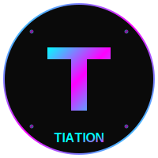

# Tiation Laptop Utilities

<div align="center">
  
  
  [](LICENSE)
  [](https://tiation.github.io/tiation-laptop-utilities)
  [](https://github.com/tiation)
  [](https://github.com/tiation)
</div>

## 🚀 Overview

Enterprise-grade laptop utilities and automation tools designed for professional developers and system administrators. This comprehensive toolkit streamlines laptop management, enhances productivity, and ensures consistent development environments across teams.

## 📋 Table of Contents

- [Features](#-features)
- [Quick Start](#-quick-start)
- [Installation](#-installation)
- [Usage](#-usage)
- [Documentation](#-documentation)
- [FAQ](#-faq)
- [Contributing](#-contributing)
- [Support](#-support)
- [License](#-license)
- [About Tiation](#-about-tiation)

---

## ✨ Features

- **🔧 System Optimization**: Automated performance tuning and resource management
- **⚡ Development Tools**: Essential developer utilities and environment setup
- **🛡️ Security Hardening**: Enhanced security configurations and monitoring
- **📊 System Monitoring**: Real-time performance and health monitoring
- **🔄 Automation Scripts**: Streamlined workflows and repetitive task automation
- **🌐 Network Tools**: Advanced networking utilities and diagnostics
- **📱 Cross-platform**: Support for macOS, Linux, and Windows
- **🎯 Team Management**: Consistent environments across development teams
- **📈 Analytics**: Usage analytics and performance insights
- **🔐 Enterprise Security**: Advanced security features and compliance tools

## 🏃‍♂️ Quick Start

```bash
# Clone the repository
git clone https://github.com/tiation/tiation-laptop-utilities.git
cd tiation-laptop-utilities

# Run the setup script
./setup.sh

# Load the utilities
source ~/.bashrc
```

## 📦 Installation

### Prerequisites

- Bash 4.0 or later
- Git
- Basic system administration knowledge

### Installation Steps

1. **Clone the repository**
   ```bash
   git clone https://github.com/tiation/tiation-laptop-utilities.git
   cd tiation-laptop-utilities
   ```

2. **Make scripts executable**
   ```bash
   chmod +x setup.sh
   chmod +x scripts/*.sh
   ```

3. **Run the setup**
   ```bash
   ./setup.sh
   ```

## 🎯 Usage

### Basic Usage

- **System Check**: `tiation-system-check` - Comprehensive system health check
- **Performance Tuning**: `tiation-optimize` - Automated performance optimization
- **Security Scan**: `tiation-security-audit` - Security vulnerability assessment
- **Environment Setup**: `tiation-dev-setup` - Development environment configuration

### Advanced Features

- **Custom Profiles**: Create organization-specific configuration profiles
- **Automated Deployment**: Deploy configurations across multiple machines
- **Monitoring Dashboard**: Real-time system monitoring and alerts

## 📚 Documentation

- **[User Guide](docs/user-guide.md)** - Complete user documentation
- **[API Reference](docs/api-reference.md)** - Technical API documentation
- **[Architecture](docs/architecture.md)** - System architecture overview
- **[Deployment Guide](docs/deployment.md)** - Enterprise deployment instructions

### Live Documentation

Visit our [GitHub Pages site](https://tiation.github.io/tiation-laptop-utilities) for interactive documentation.

## ❓ FAQ

### General Questions

**Q: What makes this solution enterprise-grade?**
A: Our utilities include comprehensive security features, centralized management, audit trails, and enterprise integration capabilities.

**Q: Can I customize the utilities for my organization?**
A: Yes, we provide extensive customization options and configuration profiles for different organizational needs.

**Q: What are the system requirements?**
A: Compatible with most modern operating systems. Specific requirements are detailed in the documentation.

### Technical Questions

**Q: How do I deploy this across multiple machines?**
A: Use our deployment scripts and configuration management tools detailed in the [Deployment Guide](docs/deployment.md).

**Q: Are there security considerations?**
A: Yes, please review our [Security Guide](docs/security.md) for comprehensive security best practices.

## 🤝 Contributing

We welcome contributions! Please see our [Contributing Guide](CONTRIBUTING.md) for details.

## 🆘 Support

### Community Support

- **GitHub Issues**: [Report bugs or request features](https://github.com/tiation/tiation-laptop-utilities/issues)
- **Discussions**: [Join community discussions](https://github.com/tiation/tiation-laptop-utilities/discussions)
- **Documentation**: [Browse our documentation](https://tiation.github.io/tiation-laptop-utilities)

### Enterprise Support

For enterprise customers, we offer:
- Priority support
- Custom development
- Training and consultation
- SLA guarantees

Contact us at [enterprise@tiation.com](mailto:enterprise@tiation.com)

## 📄 License

This project is licensed under the MIT License - see the [LICENSE](LICENSE) file for details.

## 🌟 About Tiation

**Tiation** is a leading provider of enterprise-grade software solutions, specializing in automation, productivity, and system management tools.

### Connect With Us

- **Website**: [https://github.com/tiation](https://github.com/tiation)
- **GitHub**: [https://github.com/tiation](https://github.com/tiation)
- **LinkedIn**: [Tiation Company](https://linkedin.com/company/tiation)
- **Twitter**: [@TiationTech](https://twitter.com/TiationTech)

---

<div align="center">
  <p>
    <strong>Built with ❤️ by the Tiation Team</strong>
  </p>
  <p>
    <a href="https://github.com/tiation">
      
    </a>
  </p>
</div>
